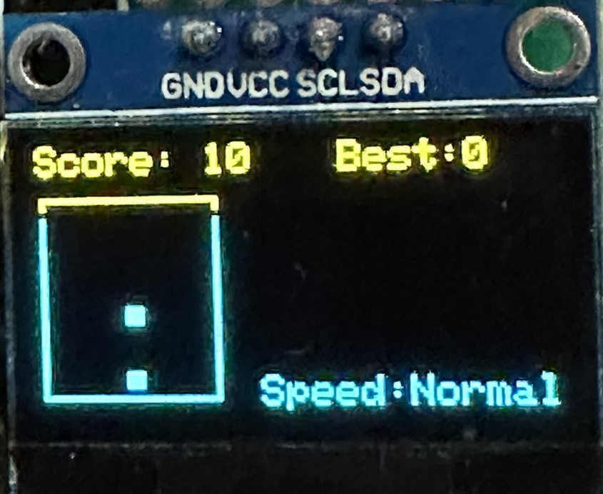

# Brick Drop Game

Brick Drop is a classic arcade-style game implemented on an Arduino using an OLED display and buttons. The objective of the game is to stack falling blocks to create full rows and clear them for points. But be careful, as the blocks fall faster and faster as you progress!

## Features

- **Menu System**: Choose from three different game speeds: Fast, Normal, and Slow.
- **Gameplay**: Move and drop falling blocks to create full rows.
- **Scoring**: Earn points for each cleared row.
- **Game Over**: The game ends when a block reaches the top of the screen.

## Hardware Requirements

- Arduino board (e.g., Arduino Uno)
- OLED display (128x64 pixels)
- Buttons (Left, Right, OK)
- Speaker for sound effects

## Getting Started

1. Set up your hardware as per the wiring diagram.
2. Install the required libraries (`Adafruit_GFX` and `Adafruit_SSD1306`).
3. Upload the code to your Arduino board.
4. Enjoy the game on the OLED display!

## Controls

- **Left Button**: Move the falling block to the left.
- **Right Button**: Move the falling block to the right.
- **OK Button**: Drop the falling block faster (press and hold).

## Customize the Game

You can customize the game by adjusting various parameters in the code, such as game speed, block colors, and sound effects.

## Acknowledgments

- The game was inspired by classic arcade block-stacking games.
- Sound effects and background music were created using Arduino's DAC capabilities.

Feel free to modify and enhance the game as you like. Have fun playing Brick Drop!
